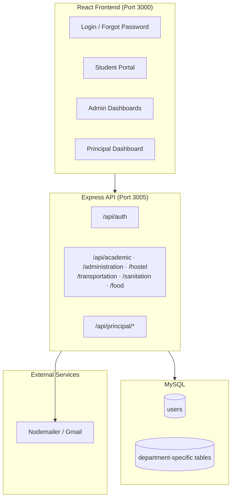

# Smart Complaint Management System

A full-stack web application for managing campus complaints across multiple departments — built for colleges and institutions that need a centralized, role-based way to collect, track, and resolve student feedback.


---

## Overview

**Smart Complaint Management System** replaces scattered, informal complaint channels with a single digital platform. Students can file complaints by category, department admins can review and respond, and the principal gets a bird's-eye view of pending, resolved, and overdue issues across the entire campus.

The system supports **6 complaint domains** — Administration, Academics, Hostel, Transportation, Sanitation, and Food — each with its own data model, admin dashboard, and resolution workflow.

---

## Key Features

### For Students
- Role-based login (Student / Admin / Principal)
- Submit complaints across 6 campus categories
- **Anonymous submission** option for sensitive feedback
- Category-specific fields (course, hostel block, vehicle number, urgency level, etc.)
- View complaint history and resolution status

### For Department Admins
- Dedicated dashboard per department
- Filter complaints by status (`pending`, `resolved`)
- Search and manage incoming complaints
- Submit official responses and mark complaints as resolved
- **Email notifications** sent to students when their complaint is resolved

### For Principal
- Unified dashboard with aggregate counts
- View all **pending**, **resolved**, and **urgent** complaints (pending > 7 days)
- Cross-department visibility across all 6 complaint tables
- Direct principal-level response and resolution

### Platform Capabilities
- JWT-based authentication with role validation
- Password reset via email (Nodemailer)
- RESTful API with modular route structure
- Responsive UI with Tailwind CSS and animated layouts

---

## Tech Stack

| Layer      | Technologies |
| ---------- | ------------ |
| Frontend   | React 19, React Router v7, Axios, Tailwind CSS, Framer Motion, React Icons |
| Backend    | Node.js, Express 5, JWT, bcryptjs |
| Database   | MySQL (mysql2) |
| Email      | Nodemailer (Gmail SMTP) |
| Tooling    | Create React App, Nodemon |

---

## Architecture



---

## Project Structure

```
Smart Complaint Management System/
├── Backend/
│   ├── controllers/          # Auth & complaint business logic
│   ├── middleware/             # JWT auth middleware
│   ├── models/
│   │   └── db.js               # MySQL connection
│   ├── routes/                 # REST API routes per department
│   │   ├── auth.js
│   │   ├── academiccomplaints.js
│   │   ├── administration.js
│   │   ├── hostel.js
│   │   ├── transport.js
│   │   ├── sanitation.js
│   │   ├── food.js
│   │   └── principal.js
│   ├── utils/
│   │   └── mailer.js           # Email utility
│   ├── server.js               # App entry point
│   └── .env                    # Environment variables (not committed)
│
└── Frontend/
    ├── public/                 # Static assets & logos
    ├── src/
    │   ├── App.js              # Route definitions
    │   ├── api.js              # Axios instance
    │   ├── LoginPage.jsx
    │   ├── Studenthomepage.jsx
    │   ├── *Complaint.jsx      # Student complaint forms
    │   ├── *Dashboard.jsx      # Admin dashboards
    │   └── Principalhomepage.jsx
    └── backup.sql              # Database schema & seed data
```

---

## Getting Started

### Prerequisites

- **Node.js** v18+
- **MySQL** v8+
- **npm** or **yarn**
- A Gmail account (or SMTP credentials) for email notifications

### 1. Clone the repository

```bash
git clone https://github.com/<your-username>/smart-complaint-management-system.git
cd smart-complaint-management-system
```

### 2. Set up the database

```bash
mysql -u root -p
```

```sql
CREATE DATABASE complaint_system;
USE complaint_system;
SOURCE Frontend/backup.sql;
```

### 3. Configure the backend

Create `Backend/.env`:

```env
# Database
DB_HOST=localhost
DB_USER=root
DB_PASSWORD=your_mysql_password
DB_NAME=complaint_system

# JWT
JWT_SECRET=your_secure_secret_key

# Email (Gmail SMTP)
EMAIL_USER=your_email@gmail.com
EMAIL_PASS=your_app_password
```

> **Note:** Update `Backend/models/db.js` to read credentials from environment variables before deploying.

Install dependencies and start the server:

```bash
cd Backend
npm install
node server.js
```

The API runs at **http://localhost:3005**

### 4. Configure and run the frontend

```bash
cd Frontend
npm install
npm start
```

The app opens at **http://localhost:3000**

---

## User Roles

| Role       | Access |
| ---------- | ------ |
| **Student**   | Submit complaints, view history, choose anonymous mode |
| **Admin**     | Manage department-specific complaints, respond, update status |
| **Principal** | Cross-department overview, urgent complaint tracking, final resolution |

Login validates that the selected role matches the account stored in the database.

---

## API Endpoints

### Authentication
| Method | Endpoint | Description |
| ------ | -------- | ----------- |
| POST | `/api/auth/login` | Login with email, password, and role |
| POST | `/api/auth/forgot-password` | Reset password via email |

### Department Complaints
Each department follows a similar REST pattern:

| Method | Endpoint | Description |
| ------ | -------- | ----------- |
| POST | `/api/{department}/submit` | Submit a new complaint |
| GET | `/api/{department}` | Fetch complaints (filter by status) |
| PUT | `/api/{department}/:id/status` | Update complaint status |
| POST | `/api/{department}/:id/response` | Submit admin response & notify student |

Departments: `academic`, `administration`, `hostel`, `transportation`, `sanitation`, `food`

### Principal
| Method | Endpoint | Description |
| ------ | -------- | ----------- |
| GET | `/api/principal/home` | Dashboard counts (pending, resolved, urgent) |
| GET | `/api/principal/pending` | All pending complaints across departments |
| GET | `/api/principal/resolved` | All resolved complaints |
| GET | `/api/principal/urgent` | Pending complaints older than 7 days |
| POST | `/api/:id/principal-response` | Principal resolution with department context |

---

## Database Schema

The system uses **department-specific tables** for flexible, category-aware complaint data:

| Table | Key Fields |
| ----- | ---------- |
| `users` | name, email, password (hashed), role |
| `academic_complaints` | description, course, complaint_type, is_anonymous |
| `administration_complaints` | text, is_anonymous, response |
| `hostel_complaints` | block, roomNumber, text, isAnonymous |
| `transport_complaints` | vehicleNumber, type, text |
| `sanitation_complaints` | location, issueType, urgency |
| `food_complaints` | campus, issueType, text |

All complaint tables track `status`, timestamps, and resolution metadata.

---

## Screenshots

> Add screenshots of the login page, student home, admin dashboard, and principal overview here before publishing to GitHub.

```
docs/screenshots/
├── login.png
├── student-home.png
├── admin-dashboard.png
└── principal-overview.png
```

---

## What I Learned / Built

- Designed a **multi-tenant complaint workflow** with separate schemas per department while keeping a unified principal view
- Implemented **role-based access control** with JWT and server-side role validation
- Built **anonymous complaint flows** that conditionally omit user identity from storage and email
- Integrated **transactional email** for password resets and complaint resolution notifications
- Created a **modular Express API** with reusable patterns across 6 department route modules

---

## Future Improvements

- [ ] Move all secrets and DB credentials to environment variables
- [ ] Add input validation middleware (e.g., Joi / express-validator)
- [ ] Implement protected routes with JWT middleware on the frontend
- [ ] Add unit and integration tests
- [ ] Dockerize the application for one-command deployment
- [ ] Real-time complaint updates with WebSockets
- [ ] Analytics dashboard with charts (complaints by category, resolution time)

---

## License

This project is open source and available under the [MIT License](LICENSE).

---

## Author

**Your Name**
- GitHub: [@your-username](https://github.com/your-username)
- LinkedIn: [Your LinkedIn](https://linkedin.com/in/your-profile)
- Email: your.email@example.com

---

<p align="center">
  Built with React & Node.js — making campus feedback actionable.
</p>
